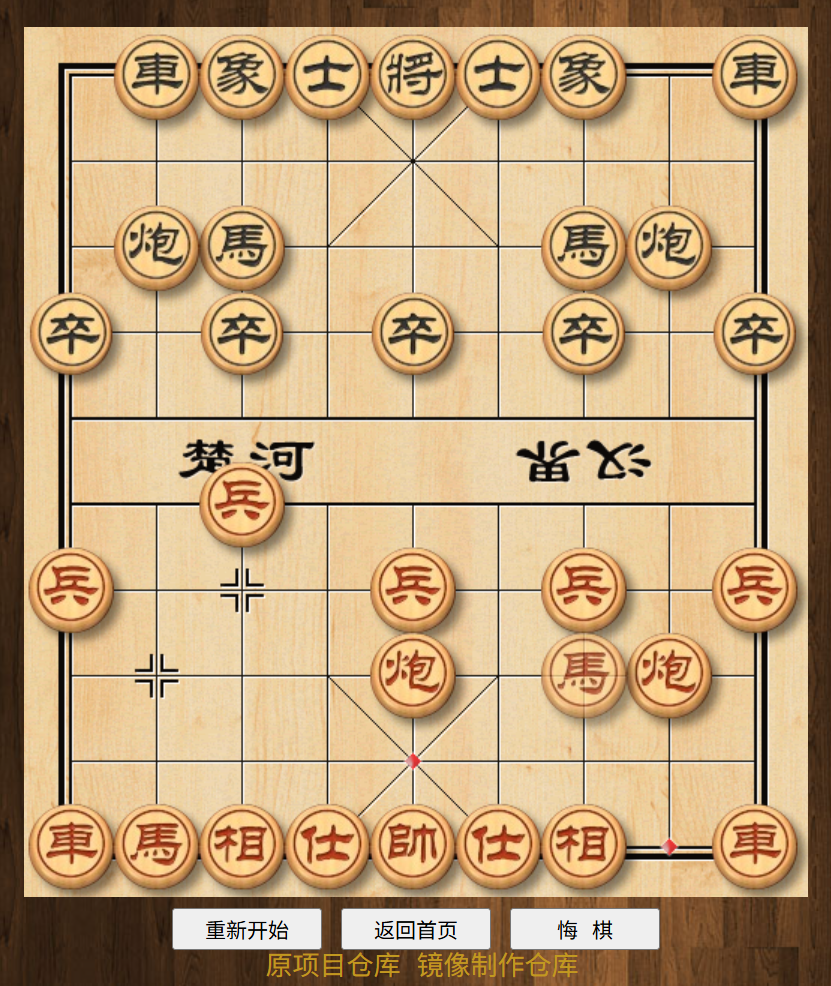

中国象棋 - in html5
===========

作者：一叶孤舟<br>
联系：itlwei@163.com  QQ:28701884<br>
Demo：https://itlwei.github.io/Chess/

中国象棋 - in html5是一款使用html5 canvas开发的开源小游戏，不依赖任何类库，不依赖任何后台程序，全部原生Javascript进行AI计算，欢迎广大业内同行多多交流指正，共同完善。

## 部署说明

首先感谢原作者的开源。[原项目地址](https://github.com/itlwei/Chess)


有需要帮忙部署这个项目的朋友,一杯奶茶,即可程远程帮你部署，需要可联系。  
微信号 `E-0_0-`  
闲鱼搜索用户 `明月人间`  
或者邮箱 `firfe163@163.com`  
如果这个项目有帮到你。欢迎start。

有其他的项目的汉化需求，欢迎提issue。或其他方式联系通知。

### 镜像

从阿里云或华为云镜像仓库拉取镜像，注意填写镜像标签，镜像仓库中没有`latest`标签

容器内部端口 3000

```bash
swr.cn-north-4.myhuaweicloud.com/firfe/chess:2025.05.13
```

### docker run 命令部署

```bash
docker run -d \
--name chess \
--network bridge \
--restart always \
--log-opt max-size=1m \
--log-opt max-file=3 \
-p 3000:3000 \
swr.cn-north-4.myhuaweicloud.com/firfe/chess:2025.05.13
```
### compose 文件部署 👍推荐

```yaml
#version: '3.9'
services:
  chess:
    container_name: chess
    image: swr.cn-north-4.myhuaweicloud.com/firfe/chess:2025.05.13
    network_mode: bridge
    restart: always
    logging:
      options:
        max-size: 1m
        max-file: '3'
    ports:
      - 3000:3000
```

## 修改说明

增加修改部分具体见 [修改说明](./修改说明.md)。

`./README.md` 文件翻译，增加 `## 部署说明`、`## 修改说明`、`## 效果截图` 部分。

增加目录 `./图片`
新增文件 `./.dockerignore`、`./Dockerfile`、`./修改说明.md`

## 效果截图




## 特点

* 全部使用Javascript完成AI人工智能计算，不依赖任何后台程序
* 不依赖任何类库，全部原生Javascript，使用html5 canvas.
* 实现中不涉及任何浏览器特性，所以不存在浏览器兼容性问题.
* 代码结构极其简洁明了，你可以轻易的阅读，修改成自己版本.

## Change Log
### v1.5.1
* 修复BUG

### v1.5.0
* 大幅度修改UI，增加风格选择

### v1.0.3
* 增加历史表，提高AI计算效率

### v1.0.2
* 修复了AI计算过深的资源耗尽问题

### v1.0.1
* 修复了一些情况下悔棋出错的问题
* 修复了长将不死的问题
